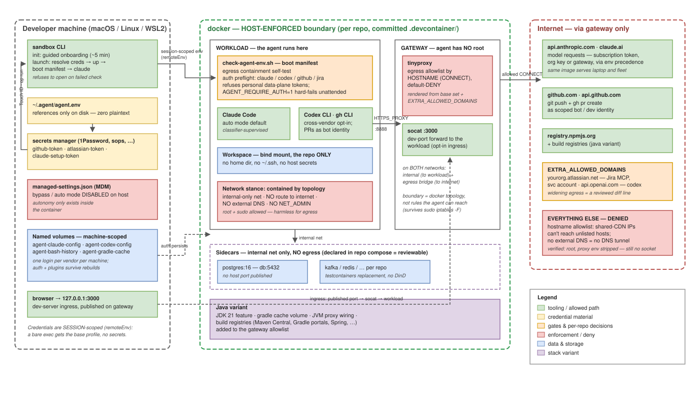

# devcontainers

A security-first devcontainer for running coding agents (Claude Code, Codex) —
**the default runtime for agent sessions**. Copy `.devcontainer/` into your repo,
drop one env file on the host, and run `sandbox` (or `Reopen in Container`) —
convenient startup *and* a blast radius the agent can't widen: the workload
container has no direct route to the internet at all, only an allowlist proxy it
can't reconfigure, so it reaches the repo, the declared sidecars, and the egress
allowlist, not your workstation.

Credentials never sit in plaintext and never live inside the box: the env file
holds *references* into a secrets manager (1Password built in; sops, Infisical,
Bitwarden SM, pass — anything that prints `KEY=value` — via one hook), resolved
at launch and delivered per-session. The agent reads only the scoped service
tokens you deliberately handed it.

The egress boundary is **host-enforced** (docker network topology plus a gateway
sidecar), not enforced by anything inside the workload — so it holds even if the agent
is root in its own container. See [Security model](#security-model--the-box-is-host-enforced).
Autonomy (auto / bypass-permissions mode) is a separate axis and it lives in the box:
those modes run only inside the container, kept off the host by managed settings (see
[Enforcement](#enforcement--autonomy-lives-in-the-box)).

Delegation is the point, not an accident: the container gets scoped service tokens
for Jira and GitHub precisely so agents can update tickets and open PRs — as an
attributable bot identity with a project/repo allowlist, never as you.



## The one rule

**Nothing enters the container's environment that you wouldn't knowingly hand the
agent.** Env vars are fully readable from inside (deny rules don't stop `env` or
`cat`). That is fine by design when the tokens are scoped service identities —
visible-but-narrow is the contract. Personal data-plane tokens never go in; the boot
check refuses them. (Attended experiments inside the container can override with
`AGENT_ALLOW_PERSONAL=1` — same trust as a host session, but say it explicitly.)

## Security model — the box is host-enforced

The workload container the agent runs in sits on a single **internal** docker network
with no gateway to the outside. It has no `NET_ADMIN`, no route to the internet, and no
external DNS. Every outbound connection goes through the **gateway** — a separate
sidecar running an allowlist forward proxy (`.devcontainer/gateway/`), reachable only
from that internal network.

Why a separate container instead of an in-container firewall: an agent that runs code
in its own container can escalate (the base image gives `node` passwordless sudo,
which the lifecycle needs). An in-container iptables policy is one `sudo iptables -F`
away from gone. The gateway lives in a container the agent has no root on, so the
boundary is the docker topology — enforced by the host, not by rules the agent can
reach. Verified: as root, with the proxy env stripped, the workload still cannot open a
socket to the internet.

What that closes, concretely:

- **Egress is allowlisted by hostname** (the proxy's CONNECT target), so a shared-CDN
  IP can't be used to reach an unlisted host.
- **No external DNS** from the workload, so DNS-tunnel exfiltration has no channel.
- **Root in the workload is harmless for egress** — no firewall to flush, no route to
  add, no capability to abuse.

The allowlist is the written-down answer to "which systems can this agent reach": the
base set (Anthropic, GitHub, npm) plus whatever `EXTRA_ALLOWED_DOMAINS` names, rendered
into the gateway's filter. Adding a data source is a one-line diff. What this does *not*
contain: the scoped service tokens you deliberately hand the workload are readable
inside it by design, and the agent can use an allowlisted destination as itself (push to
a repo its token can reach). Egress containment is the network boundary, not a
substitute for keeping those tokens scoped.

## What you get

| Piece                                      | Job                                                                                                                      |
|--------------------------------------------|--------------------------------------------------------------------------------------------------------------------------|
| `.devcontainer/devcontainer.json`          | Base profile: Claude Code installed, auth persisted across rebuilds, host env-file wiring, workload wired to the gateway |
| `.devcontainer/docker-compose.yml`         | Two containers + networks: workload (internal-only, no egress) and gateway (allowlist proxy); carries the repo-owned anchors (egress allowlist, plugin provisioning) |
| `.devcontainer/docker-compose.override.yml`| Repo-owned local-patch slot (extra sidecar, a mount, a fix awaited upstream); ships empty, preserved by `sandbox sync`   |
| `.devcontainer/gateway/`                   | The egress gateway image (tinyproxy, built from a trusted base); renders the allowlist from `EXTRA_ALLOWED_DOMAINS`      |
| `.devcontainer/check-agent-env.sh`         | Boot check: egress containment self-test, LLM auth preflight, prints which identity the agent will read                  |
| `.devcontainer/setup-cross-vendor.sh`      | Opt-in second vendor: installs Codex CLI only when the repo's egress allowlist names an OpenAI domain                     |
| `.devcontainer/setup-memspec.sh`           | Opt-in agent memory: installs the pinned memspec engine + a disposable scratch store (only wired when a repo commits `.memspec.yaml`) |
| `.devcontainer/mcp/with-atlassian.mcp.json`| Opt-in variant: read-only Jira/Confluence via a scoped service token                                                     |
| `.devcontainer/mcp/with-memspec.mcp.json`  | Opt-in variant: the memspec memory MCP (search/remember/reconcile) for repos that opt into memspec                       |
| `.devcontainer/variants/java/`             | Java/Gradle: JDK 21, build-registry allowlist + JVM proxy, shared gradle cache volume, internal-only  sidecars (DB etc.) |
| `agent.env.example`                        | The host-side env file shape (`~/.agent/agent.env` — never inside the repo)                                              |
| `sandbox` / `sandbox.cmd`                  | One-word entry point: container up + boot check + Claude, feels like `claude`; the `.cmd` relay makes it work from PowerShell/cmd too |

## Design decisions (why it looks like this)

- **Default profile carries no MCP.** Every unattended run automatically has whatever
  the template grants, so the base grant is nothing. Data sources are opt-in variants
  per task class.
- **Secrets by absence.** The workspace mount is the repo only. `~/.agent/agent.env`
  holds *references* into a secrets manager, not values; the `sandbox` wrapper
  resolves it at launch and the container gets variables per-session via `remoteEnv`.
  Nothing lands in the image, the container config, or `docker inspect`. Two backend
  shapes, see `agent.env.example`: 1Password `op://` refs are auto-detected (zero
  plaintext at rest, biometric unlock via `op run`); every other manager plugs in
  through `AGENT_ENV_COMMAND` — any command that prints `KEY=value` lines (sops+age,
  Infisical, Doppler, Bitwarden Secrets Manager, pass/gopass, Vault…). Plain values
  remain the explicit fallback (`chmod 600`).
- **Egress is a written-down decision.** The gateway allowlist is the explicit answer
  to "which systems can this agent reach." Adding a data source means adding a domain,
  in a reviewable diff.
- **Auth survives rebuilds.** A named volume persists `~/.claude`, so Claude login and
  MCP OAuth don't need re-wrangling every rebuild.
- **Org plugins are provisioned, not hoped for.** Marketplaces and installed plugins
  live in the per-machine volume, so a fresh machine has neither — the HUD statusline
  stays silently empty and org skills are absent. The compose anchors
  `x-plugin-marketplaces` / `x-plugin-baseline` declare the baseline (marketplace
  slugs and `plugin@marketplace` ids); the boot check adds whatever is missing,
  idempotently. They ship empty here — set them to your org's marketplace to opt in.
  Private marketplace clones need `GITHUB_TOKEN`, so an IDE-launched session defers
  provisioning to the first `sandbox` run — the volume keeps the result.
- **The lazy path is the narrow path.** Variant env names only fit scoped tokens
  (`ATLASSIAN_AGENT_RO_TOKEN`); the boot check calls the API and refuses to proceed if
  the identity doesn't look like a service account.

## Platforms

macOS and Linux are first-class (Linux: native docker + the 1Password Linux app;
managed settings at `/etc/claude-code/managed-settings.json`). **Windows:
native Git Bash is the supported path** — the `sandbox` wrapper and the
template are field-tested under MINGW64 (Git for Windows) with Docker Desktop,
per [WINDOWS.md](WINDOWS.md), which also covers the two things that bite there
and nowhere else: the consuming repo's CRLF worktree, and needing a template new
enough that "Reopen in Container" works at all. WSL2 works too and is just
the Linux flow inside WSL. The `sandbox.cmd` relay lets `sandbox` run from
PowerShell/cmd, but it just hands off to Git Bash — Git Bash is still required.
Native-Windows caveat: verify the managed-settings enforcement path for that
host separately — the host-tier autonomy lockout is documented for macOS/Linux
paths only.

Prerequisite for **both** launch paths: `node` on the *host* PATH. `initializeCommand`
runs `.devcontainer/write-env.cjs` on the host, before any container exists, to hand
compose the repo name — and it has no shell fallback. An IDE's own bundled node doesn't
count; it isn't on PATH.

## Setup (once per developer)

```bash
# macOS (homebrew): cp sandbox /opt/homebrew/bin/
# Linux:            install -D sandbox ~/.local/bin/sandbox   (ensure it's on PATH)
sandbox init
```

`sandbox init` walks the rest: prereq checks, credential capture straight into
1Password when its CLI is present (biometric unlock; plaintext `chmod 600`
fallback otherwise — rerun after installing 1Password and it migrates the values
into the vault), and live validation of every token. Using a different secrets
manager (sops, Infisical, Bitwarden SM, pass, …)? Hand-edit `~/.agent/agent.env`
per `agent.env.example` and set `AGENT_ENV_COMMAND` — the wrapper sources
whatever `KEY=value` lines your manager prints, same session-scoped delivery.

## Daily flow

```bash
sandbox                    # interactive Claude inside the repo's container
sandbox -p "close TICKET-123: implement, test, open the PR"   # headless dispatch
sandbox sync               # pull the latest template, review the git diff, commit
sandbox rebuild            # recreate the container so synced changes actually apply
```

`sandbox` brings the container up (seconds when cached), prints the boot check —
which identities Jira/GitHub calls run as, whether vendor auth is alive, the egress
containment self-test — and drops you into Claude. Same repo checkout as the host
(bind mount), so nothing to sync.

`sandbox sync` preserves the repo-owned compose anchors (egress allowlist, plugin
provisioning) and the `docker-compose.override.yml` local-patch slot across template
updates, and tells you whether a `rebuild` is needed to apply what changed.

## Reaching a dev server from your machine

Egress (the workload calling out) goes through the gateway; reaching a web server the
workload *serves* is separate ingress, and how you get it depends on how you launched:

- **VS Code "Reopen in Container": automatic.** VS Code forwards any port your dev
  server opens over its own remote channel — independent of the network, so the
  internal workload is no obstacle. `localhost:3000` on your machine just works.
- **Headless / `sandbox`: opt in per port.** Published ports (`-p`) don't reach an
  internal-only workload, so the gateway (which sits on a host-reachable network)
  forwards them instead. To expose the workload's `:3000`:
  1. In `.devcontainer/docker-compose.yml`, set the gateway's `DEV_FORWARD_PORTS: "3000"`.
  2. Uncomment the matching publish on the gateway: `ports: ["127.0.0.1:3000:3000"]`.
  Rebuild; `http://127.0.0.1:3000` on your machine now reaches the workload. Ingress
  only — it gives the workload no outbound path, so egress stays gated.
- **One-off, no config:** forward over the docker exec channel yourself —
  `socat TCP-LISTEN:3000,reuseaddr,fork SYSTEM:"docker exec -i <workload> nc localhost 3000"`.

Verified on real dockerd: with a port forwarded, `http://127.0.0.1:3000` reaches the
workload's server while the workload still shows no direct egress.

## Enforcement — autonomy lives in the box

Policy prose doesn't stop `claude --dangerously-skip-permissions` on a host; managed
settings do. MDM-deploy this to workstations
(`/Library/Application Support/ClaudeCode/managed-settings.json` on macOS,
`/etc/claude-code/managed-settings.json` on Linux):

```json
{
  "permissions": {
    "disableBypassPermissionsMode": "disable",
    "disableAutoMode": "disable"
  }
}
```

Managed settings outrank everything user-editable, and the Linux container has no
managed-settings file — so bypass/auto modes physically don't start on the host and
work normally in the sandbox. The paved road becomes the only road; keep
`disableAutoMode` or drop it depending on how strict the host tier should be.

## Setup (once per repo)

```bash
cp -R .devcontainer <your-repo>/    # includes gateway/
# then, if the repo's tasks need Jira/Confluence context:
#   1. merge .devcontainer/mcp/with-atlassian.mcp.json into the repo's .mcp.json
#   2. add your Atlassian domain to the x-extra-allowed-domains anchor in
#      .devcontainer/docker-compose.yml (one place; both workload and gateway read it)
```

Open the repo in VS Code → **Reopen in Container**. First build takes minutes, cached
after. The boot check prints the agent's effective identity on every start.

## Cross-vendor repos (Claude + Codex)

A second model vendor is an egress decision like any other — opt-in per repo, never in
the base profile. To enable:

1. Set the `x-extra-allowed-domains` anchor in `.devcontainer/docker-compose.yml` to
   include `auth.openai.com,chatgpt.com,api.openai.com`. That's the whole switch: the
   gateway allows those hosts, and `setup-cross-vendor.sh` sees an OpenAI domain and
   installs the Codex CLI (from the already-allowlisted npm registry). Otherwise it
   installs nothing.
2. Seed auth once from an **attended** session inside the container: `codex login`
   (browser flow). It persists in the `agent-codex-config` volume across rebuilds,
   same contract as Claude auth.
3. Install the tooling plugins per repo, not per user — extend the repo-owned
   plugin anchors in `.devcontainer/docker-compose.yml` so the boot check
   provisions them on every machine, no manual `/plugin` commands:

   ```yaml
   x-plugin-marketplaces: &plugin_marketplaces "yourorg/ai-plugins"
   x-plugin-baseline: &plugin_baseline "your-plugin@org-skills,another@org-skills"
   ```

   The boot check adds what's declared and missing (idempotent; the result
   persists in the per-machine volume, and `sandbox sync` preserves both anchors).
   Fetching a private marketplace repo from inside the container needs a
   read-only `GITHUB_TOKEN` in `~/.agent/agent.env` (contents: read on
   that one repo — scoped, not your personal all-repo PAT). In the
   marketplace repo itself, add the working tree as a directory-source
   marketplace instead (`claude plugin marketplace add .`) — the sandbox then
   serves the plugins from the tree you're editing.

The boot check reports Codex install/auth state on every start, next to the identity
line, so an unattended run never discovers a missing second vendor mid-task.

## Node repos — private npm packages, `node_modules`

Two mechanisms make `npm ci` → build → test work in the box on a real monorepo with
private `@yourorg/*` packages:

- **`node_modules` is a per-repo named volume** (`sandbox-node-modules-<repo>-<hash>`,
  where the 8-char hash of the full checkout path keeps two same-named repos apart),
  not the host's tree. Native binaries are per-platform — the host holds
  win32/darwin esbuild and rollup builds, the container needs linux ones — so a
  tree shared through the bind mount is broken on one side or the other. Worse,
  a container `npm ci` clears `node_modules` *before* failing auth, which used
  to destroy the HOST's install through the mount. Each side now owns its
  install: run `npm ci` once in the box on first use; the volume persists
  across rebuilds.
- **The GitHub Packages credential is materialized, not env-read.** npm never
  consumes `GITHUB_TOKEN` from the environment — it needs an `_authToken` line
  in its userconfig, which compose points into the per-machine `agent-npm-config`
  volume. The boot check upserts `//npm.pkg.github.com/:_authToken=…` whenever a
  wrapper session carries the token, so IDE-launched sessions and every later
  `npm ci` read the same file (same at-rest contract as the gradle variant's
  `gradle.properties`). Machine-scoped on purpose: every wrapper-launched
  sandbox on the machine already receives the same `GITHUB_TOKEN` through
  `remoteEnv` (there is one `~/.agent/agent.env` per machine), so the shared
  volume adds no audience the env didn't already have. Scope note: GitHub
  Packages accepts only classic/OAuth tokens (a fine-grained PAT authenticates
  to the API but E403s at the registry — `sandbox init` now preflights this),
  so keep the token minimal the classic way: `read:packages` (+ `repo` for git
  delegation), forced expiry. Note that
  `sandbox init` keeps an already-stored token rather than re-capturing: after
  rotating or re-scoping (e.g. `gh auth refresh -s read:packages`), clear the
  stored `github-token` and rerun `sandbox init` so the new value propagates —
  the boot check's upsert then rewrites the userconfig on the next wrapper
  launch. The scope→registry mapping
  (`@yourorg:registry=https://npm.pkg.github.com`) is repo config, not a secret —
  commit it in the repo's `.npmrc`. Without it npm never reaches the private
  registry and reports a misleading 404 from the public one instead of a clean 401.

Known limits, both served by the override slot: only the repo-root
`node_modules` is shadowed — a workspace layout that installs nested trees
(`packages/ui/node_modules`) or a java-variant monorepo with frontend modules
keeps those paths on the host bind mount, so declare additional volumes for
them in `docker-compose.override.yml` per repo. And the override keep-list
needs the `sandbox` wrapper from `2026-08-12a` or newer on the machine — an
older installed wrapper's sync flattens a repo's override back to the empty
stub (visible in the post-sync `git diff`, but update the wrapper).

## Java / compose-sidecar variant

For Gradle/Java repos (Spring services, multi-module monorepos), copy the base
`.devcontainer/` wholesale first (so `gateway/`, `check-agent-env.sh` etc. come along),
then copy BOTH files from `.devcontainer/variants/java/` into `.devcontainer/`,
**overwriting** the base `devcontainer.json` AND the base `docker-compose.yml`:

```bash
cp .devcontainer/variants/java/devcontainer.json .devcontainer/devcontainer.json
cp .devcontainer/variants/java/docker-compose.yml .devcontainer/docker-compose.yml
printf 'java\n' > .devcontainer/TEMPLATE_VARIANT   # sandbox sync re-applies the variant
```

Mixing the variant `devcontainer.json` with the base compose fails at postCreate
(the base compose carries no gradle volume, no JVM proxy wiring, and an empty
build-registry allowlist) — the boot guard names this exact mistake. What changes:

- **JDK 21** rides the node base image as a feature (claude-code needs node anyway);
  the gradle *wrapper* downloads the repo's pinned Gradle through the gateway.
- **Build-plane allowlist defaults** cover Maven Central, the Gradle portals, Spring,
  jitpack and GitHub Packages. Extend the `x-extra-allowed-domains` anchor to match the
  repo's `repositories {}` blocks — the gateway denying a resolve is the signal you
  missed one. GitHub Packages also needs `GITHUB_USER` + a packages-scoped
  `GITHUB_TOKEN` in `~/.agent/agent.env` (`sandbox init` writes `GITHUB_USER`
  automatically after validating the token).
- **JVM proxy wiring.** The JVM ignores `HTTPS_PROXY` env, so `JAVA_TOOL_OPTIONS` sets
  `-Dhttps.proxyHost=gateway` (and `http`, and `nonProxyHosts` for `db`/loopback).
  Without it Gradle's wrapper download and dependency resolution fail closed.
- **`agent-gradle-cache` volume** — the dependency world downloads once per machine,
  not once per rebuild.
- **GitHub Packages credentials persist into that volume.** The boot check upserts
  `githubUser`/`gitHubPrivateToken` (and `gpr.user`/`gpr.key`) into
  `~/.gradle/gradle.properties` from the session env, so builds started from an
  IDE attached to the container — IntelliJ or VS Code, which never pass through the
  `sandbox` wrapper — resolve private dependencies too. Both engineer workflows are
  first-class: agent-CLI sessions get the token per session, IDE sessions read the
  materialized file. This puts the token at rest in a machine-local volume — the
  same class as the vendor logins in `agent-claude-config` — so keep it minimal:
  GitHub Packages accepts only classic/OAuth tokens (fine-grained PATs E403 at
  the registry), which means `read:packages` scope and forced expiry.
- **Sidecars instead of testcontainers.** Docker-in-docker stays out of scope; the
  compose file declares integration-test services (postgres ships as the example) as
  siblings on the same `internal` network — **no egress** of their own, so a superuser
  `COPY ... FROM PROGRAM` shell in the DB reaches nowhere. The workload reaches
  `db:5432` directly (internal net); point the build at it by hostname (`-PdbHost=db`).

Verified on real Moby dockerd (`devcontainer up`): a JVM resolves Maven Central through
the gateway (200), a non-allowlisted host is denied (`403 Filtered`), `db:5432` is
reachable from the workload, and the DB sidecar has no egress of its own.

## LLM vendor auth — one login per machine, three tiers

The `agent-claude-config` / `agent-codex-config` volume names are fixed, so **every
repo sandbox on a machine shares one auth volume per vendor**: log in once per vendor
per machine, and both CLIs self-refresh their sessions while in use. No per-repo, no
per-rebuild ceremony. The boot check preflights auth on every start and prints the
exact recovery command when a login is missing or expired; set `AGENT_REQUIRE_AUTH=1`
for unattended repos so a dead login fails the run at boot instead of mid-task.

Pick the tier that matches who's responsible for the run:

- **Developer machine (default):** attended `claude login` / `codex login` into the
  shared volume, riding the developer's (ideally org-managed) seat. Cheapest, zero
  recurring ceremony.
  *In-container login gotcha:* the printed OAuth URL wraps across terminal lines —
  a raw copy inserts whitespace mid-URL and the browser fails with "Redirect URI …
  not supported by client". Rejoin it to one line in an editor first (then paste
  the code the browser shows back into the terminal), or sidestep the dance with
  a host-side `claude setup-token` → `CLAUDE_CODE_OAUTH_TOKEN` in agent.env.
- **Long unattended Claude runs:** headless OAuth refresh is unreliable — generate a
  1-year inference-only token with `claude setup-token` and put it in
  `~/.agent/agent.env` as `CLAUDE_CODE_OAUTH_TOKEN`. It outranks the volume login
  automatically.
- **CI / fleet:** org-held credentials only (`ANTHROPIC_BASE_URL` +
  `ANTHROPIC_AUTH_TOKEN` for a gateway, or `ANTHROPIC_API_KEY` / `OPENAI_API_KEY`).
  Claude Code's auth precedence puts env credentials above volume login, so the same
  image serves laptop and fleet without a fork.

**Never copy the auth volumes or `auth.json` to another machine or into CI.** Codex
refresh tokens are single-use — two concurrent copies log each other out (OpenAI's
own CI guidance: one auth state per machine or serialized job stream). Machine-local
sharing is the design; cross-machine copying is broken by design.

## Related work

- [Anthropic's reference devcontainer](https://github.com/anthropics/claude-code/tree/main/.devcontainer)
  puts the firewall *inside* the agent's container, with `NET_ADMIN` — one
  `sudo iptables -F` from gone. Anthropic's own docs suggest
  ["your own network controls instead"](https://code.claude.com/docs/en/devcontainer#restrict-network-egress);
  this repo is one answer to that.
- [o3s](https://github.com/Hansehart/o3s) reaches the same conclusion (enforcement
  belongs in a separate gateway the agent can't reach) with a different mechanism:
  netfilter/ipset per-host-and-port rules, dnsmasq feeding DNS answers into ipsets.
  Transparent to proxy-unaware tools, at the cost of the netfilter rule set and
  SNI-blind IP filtering. This repo instead uses an application-layer CONNECT proxy
  (hostname-aware, no IP-rotation problem) plus an internal-only network — the
  workload has no route at all, so non-proxy protocols are dead by construction.
  o3s ships DinD/k8s inside and a multi-repo worktree workspace, which this
  template deliberately doesn't (yet). Both are honest about the same residual:
  no network boundary stops exfiltration to a host you *did* allowlist.
- Where this repo spends its extra effort: the credential path (references-only
  env file, secrets-manager resolution, session-scoped delivery, boot-time
  identity preflight) and the org story (scoped bot identities, managed-settings
  enforcement, auth tiers from laptop to CI).

## What this does NOT solve

- Provisioning the scoped service identities (an org/admin task — make it a one-click
  request, or people will "temporarily" use personal tokens).
- Dockerized MCP servers (docker-in-docker); prefer `uvx`/`npx`-launched servers or
  remote SSE inside containers.
- macOS bind-mount performance on file-heavy workloads.
